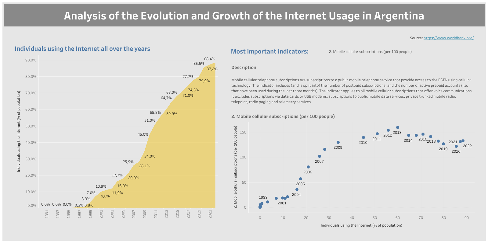

## Case Mercado Livre - Camila Kaori Ito
Data: 18/08/2024

### Fluxo de análise
1. Seleção de indicadores de desenvolvimento da Argentina no site [WorldBank.org](https://databank.worldbank.org/source/world-development-indicators#).

    O critério de seleção dos indicadores se baseou na busca de séries sócio-demográficas do país e também relacionadas ao uso de internet na Argentina.

1. Análise de correlação entre todas os indicadores selecionados, através da [geração automatizada do gráfico de correlação](./Work_Folder/data_profiling_report.html) gerado pela biblioteca em Python `ydata-profiling` através de um [notebook Jupyter](./Work_Folder/data_profiling.ipynb).

    A análise simplista nos trouxe indicações relevantes de séries sócio-demográficas relacionadas ao aumento do uso de internet, como:

    - Assinaturas de banda larga fixa e móvel;
    - Anos de educação compulsória;
    - Força de trabalho total;

    Mas também trouxe séries que não pareciam diretamente relacionadas, como:
    - População com mais de 65 anos;
    - Investimento do governo em saúde pública;
    - Entre outros...

1. Para afunilar os indicadores que mais tinham relação com a nossa principal métrica (_Individuals using the internet (% of population)_), buscou-se a execução de uma etapa de _Feature Importance_ para nos ajudar a compreender melhor o dado. A [_Feature Importance_](https://builtin.com/data-science/feature-importance) é uma técnica comum aplicada durante a criação de modelos para selecionar as features que mais tem relação com uma variável _target_ ("alvo").

    Após a [criação de um modelo de regressão](./Work_Folder/feature_importance.ipynb) usando a bibliteca de modelagem _low-code_ [PyCaret](https://pycaret.org/), conseguiu-se identificar indicadores mais relevantes e que tinham maior possibilidade de justificar o aumento do uso de internet na Argentina.

1. A partir da seleção de 10 indicadores que se mostraram mais importantes, montou-se o _dashboard_ no Tableau Public, que pode ser navegado através deste [link](https://public.tableau.com/app/profile/camila.ito/viz/ML_CASE/Dashboard):

    

### Conclusão

Com base nas análises, podemos identificar algumas possíveis causas para o crescimento da internet na Argentina:

- **Urbanização**: A correlação forte entre usuários de internet e população urbana pode indicar que a urbanização pode ter facilitado o acesso à internet devido à melhor infraestrutura nestas áreas. Entre o uso de internet para fins pessoais e também profissionais dentro das empresas que dependem cada vez mais do uso de internet.

- **Acesso à banda larga em dispositivos móveis**: A correlação entre usuários de internet e assinaturas de celular possibilita o entendimento de que o aumento no uso de dispositivos móveis facilitou o acesso à internet, chegando ao ponto de ter mais de uma assinatura por habitante no país, tendência que se inverteu em meados de 2013-2014.

- **População de 0-14**: Maior utilização de internet nesta faixa etária apesar de sua menor representatividade perante a população total.

### Entregáveis

- [**Visualização no Tableau Public**](https://public.tableau.com/app/profile/camila.ito/viz/ML_CASE/Dashboard)

##### Materiais de apoio
- [Indicadores extraídos do WorldBank (.xlsx)](./Work_Folder/Fonte_original_sem_2023.xlsx)
- [Pasta de trabalho Tableau (.twbx)](./Tableau/ML_CASE.twbx)
- [Notebook de data profiling (.ipynb)](./Work_Folder/data_profiling.ipynb)
- [Relatório de data profiling (.html)](./Work_Folder/data_profiling_report.html)
- [Notebook de feature importance (.ipynb)](./Work_Folder/feature_importance.ipynb)