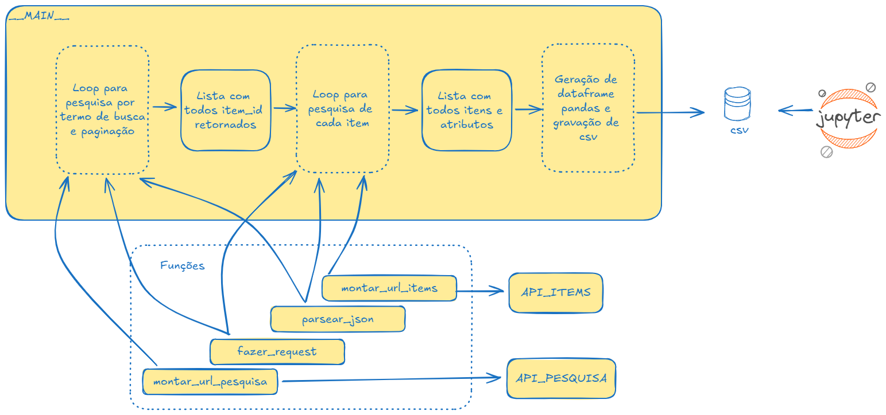

## Challenge Engineer - Python y APIs - Camila Kaori Ito
Data: 21/08/2024

### Script

##### Arquivos:

- [Script de consulta de itens](script.py)

- [Resultado](resultado.csv)

##### Fluxo da solução

##### Arquivos

- [Notebook jupyter de Análises](Analises.ipynb)